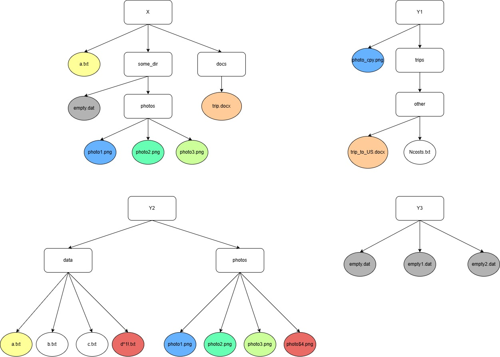

# Dokumentacja Projektu: Organizacja Systemu Plików

## Autor
Karol Kuc

## Wprowadzenie
Celem projektu jest napisanie skryptu w wybranym języku (w moim przypadku jest to **Python + Bash**) który umożliwi wykonanie różnych, opisanych w instrukcji operacji na systemie plików prowadzących do porządkowania struktury plików.

W celu realizacji zadania napisałem opisane poniżej skrypty.

- ### Uwaga!!!
W celu uruchomienia skryptów nie są wymagane żadne zewnętrzne biblioteki. Jednakże trzeba mieć zainstalowaną wersję **pythona 3.9 lub nowszą** z powodu type hints.

----------

## Skrypty

- ## Skrypt Uruchamiający Projekt

- ### Opis
**run.sh** : Skrypt Bash odpowiedzialny za stworzenie przykładowej struktury plików i katalogów (przy pomocy opisanego poniżej skryptu **create_fs.sh**) a następnie uruchomieniu na stworzonej strukturze właściwego skryptu **file_organizer.py** odpowiedzialnego za porządkowanie systemu plików.

- ### Uwaga!!!
Ten skrypt służy do demonstracji działania napisanego programu na przykładowej strukturze plików opisanej poniżej w dokumentacji.

Jeśli chcesz uruchomić file_organizer.py na dowolnej istniejącej strukturze katalogów, możesz to zrobić bez użycia skryptu run.sh. Wystarczy wywołać go w następujący sposób:

python3 ./file_organizer.py <Główny katalog> [Pozostałe katalogi]
Główny katalog: Ścieżka do głównego katalogu, w którym mają się znaleźć wszystkie pliki.
[Pozostałe katalogi] (opcjonalne): Dodatkowe katalogi do uwzględnienia w procesie organizacji.
Przykład użycia:

python3 ./file_organizer.py /home/user/documents /home/user/photos
W powyższym przykładzie skrypt uporządkuje pliki znajdujące się w katalogach /home/user/documents oraz /home/user/photos.

- ## Skrypt Tworzący Strukturę Plików

- ### Opis
**create_fs.sh** : Skrypt Bash tworzy strukturę katalogów i plików z zawartością w odpowiednich miejscach. Struktura zawiera katalogi i pliki przeznaczone do różnych celów, takich jak zdjęcia, dokumenty, dane i inne.

## Struktura Katalogów i Plików

## Wyjaśnienie kolorów na diagramie struktury plików

Na diagramie przedstawiono strukturę plików, w której zastosowano różne kolory w celu wyróżnienia typów plików:

- **Szary**: Pliki puste (np. `empty.dat`, `empty1.dat`).
- **Czerwony**: Pliki o specjalnych nazwach lub zawierające znaki specjalne (np. `d*1!.txt`).
- **Pozostałe Kolory**: są używane w celu wskazania **duplikatów**. Jeśli oba pliki mają taki sam kolor (inny niż te wspomniane powyżej) - oznacza to, że ich zawartość jest identyczna.

### Legenda

Każdy kolor ma na celu ułatwienie identyfikacji rodzaju plików oraz ich znaczenia w strukturze folderów.

- ## Skrypt Usuwający Strukturę Plików
- ### Opis
**delete_fs.sh** : Skrypt Bash odpowiada za usunięcie wszystkich wcześniej utworzonych katalogów i plików przy pomocy **create_fs.sh**.

## Klasy w Projekcie
### FileComparision
Klasa odpowiada za różnorodne operacje porównawcze na plikach.

#### Funkcje:
-   **compare_two_files(file1, file2)**: Porównuje zawartość dwóch plików.

-   **check_if_file_empty(file)**: Sprawdza, czy plik jest pusty.

-   **check_if_file_is_newer_ver_of_other(file1, file2)**: Sprawdza, czy jeden plik jest nowszą wersją drugiego.

### FileSysFinder
Klasa odpowiedzialna za wyszukiwanie plików w systemie plików.

#### Funkcje:
-   **get_all_files_from_dir(dir_path)**: Pobiera wszystkie pliki z danego katalogu.

-   **find_empty_files()**: Znajduje wszystkie puste pliki.

-   **find_duplicates()**: Znajduje zduplikowane pliki.

-   **find_files_with_bad_names()**: Znajduje pliki z nieprawidłowymi nazwami.

-   **find_newer_ver_of_file()**: Znajduje nowsze wersje plików.

### FileOrganizer
Klasa główna zarządzająca organizacją systemu plików.

#### Funkcje:
-   **organize_fs()**: Główna funkcja organizująca pliki - obsługuje puste pliki, duplikaty i złe nazwy plików.

-   **remove_files_from_fs(files_to_remove)**: Usuwa pliki z systemu plików.

-   **replace_bad_symbols_with_special_char(f_name, char)**: Zastępuje nieprawidłowe symbole w nazwach plików.

### FileOrganizerUI
Klasa obsługująca interfejs użytkownika dla operacji organizacji plików.

#### Funkcje:
-   **show_empty_files(empty_files)**: Wyświetla listę pustych plików.

-   **show_duplicates(duplicates)**: Wyświetla listę zduplikowanych plików.

-   **show_files_with_bad_names(files_with_bad_names)**: Wyświetla listę plików z nieprawidłowymi nazwami.

-   **ask_what_to_do_with_bad_f_names()**: Pyta użytkownika, co zrobić z nieprawidłowymi nazwami plików.

## Działanie
- Główna klasa (**FileOrganizer**) posiada metodę *organize_fs* która po kolei:
1. Sprawdza czy nie ma pustych plików a jeśli takie pliki istnieją użytkownik dostaje możliwość:
-   Usunięcia Wszystkich pustych plików
-   Zostawienia Wszystkich pustych plików
-   Usunięcia Tylko Wybranych Plików
2. Sprawdza istnienie takich samych plików w systemie (duplikatów). Użytkownik ma możliwość:
-   Usunięcia Wszystkich Duplikatów **Znajdujących się poza Głównym Katalogiem**
-   Pozostawienie Duplikatów
3. Sprawdza istnienie plików zawierających kłopotliwe znaki ([":", "”", ";", "*", "?", "$", "#", "‘", "|", "\\"]). Użytkownik ma możliwość:
-   Zamiany wszystkich kłopotliwych znaków w nazwach plików na ustalony symbol np. "_"
-   Pozostawienia Plików
4.  Finalnie funkcja przenosi wszystkie unikalne pliki (pliki które znajdują się w pozostałych katalogach a nie ma ich w głównym) z innych katalogów do katalogu głównego.
5.  Działanie programu się kończy.
